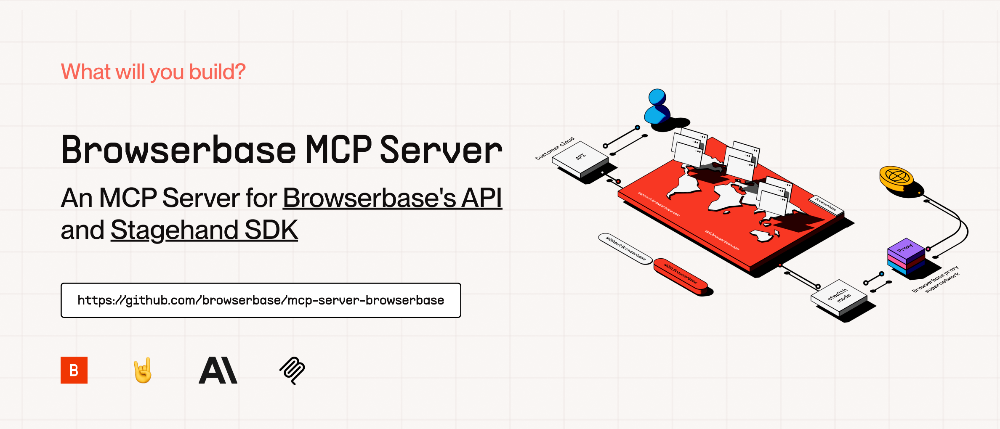

# Browserbase MCP Server

[The Model Context Protocol (MCP)](https://modelcontextprotocol.io/introduction) is an open protocol that enables seamless integration between LLM applications and external data sources and tools. Whether you’re building an AI-powered IDE, enhancing a chat interface, or creating custom AI workflows, MCP provides a standardized way to connect LLMs with the context they need.

This server provides cloud browser automation capabilities using [Browserbase](https://www.browserbase.com/), [Puppeteer](https://pptr.dev/), and [Stagehand](https://github.com/browserbase/stagehand). This server enables LLMs to interact with web pages, take screenshots, and execute JavaScript in a cloud browser environment.

To learn to get started with Browserbase, check out [Browserbase MCP](./browserbase/README.md) or [Stagehand MCP](./stagehand/README.md).

## Getting Started with available MCPs

🌐 **Browserbase MCP** - Located in [`browserbase/`](./browserbase/)

| Feature            | Description                               |
| ------------------ | ----------------------------------------- |
| Browser Automation | Control and orchestrate cloud browsers    |
| Data Extraction    | Extract structured data from any webpage  |
| Console Monitoring | Track and analyze browser console logs    |
| Screenshots        | Capture full-page and element screenshots |
| JavaScript         | Execute custom JS in the browser context  |
| Web Interaction    | Navigate, click, and fill forms with ease |

🤘 **Stagehand MCP** - Located in [`stagehand/`](./stagehand/)

| Feature             | Description                                                                                                                                                    |
| ------------------- | -------------------------------------------------------------------------------------------------------------------------------------------------------------- |
| Atomic Instructions | Execute precise actions like `act("click the login button")` or `extract("find the red shoes")`                                                                |
| Model Flexibility   | Supports multiple models, including OpenAI's GPT-4 and Anthropic's Claude-3.7 Sonnet                                                                           |
| Modular Design      | Easily integrate new models with minimal changes                                                                                                               |
| Vision Support      | Use annotated screenshots for complex DOMs                                                                                                                     |
| Open Source         | Contribute to the project and join the [Slack community](https://join.slack.com/t/stagehand-dev/shared_invite/zt-2uvuobu50-~wVSx2Si75CPa3332hwVEw) for support |

### Alternative Installation Methods

[Smithery](https://smithery.ai/server/@browserbasehq/mcp-browserbase)
