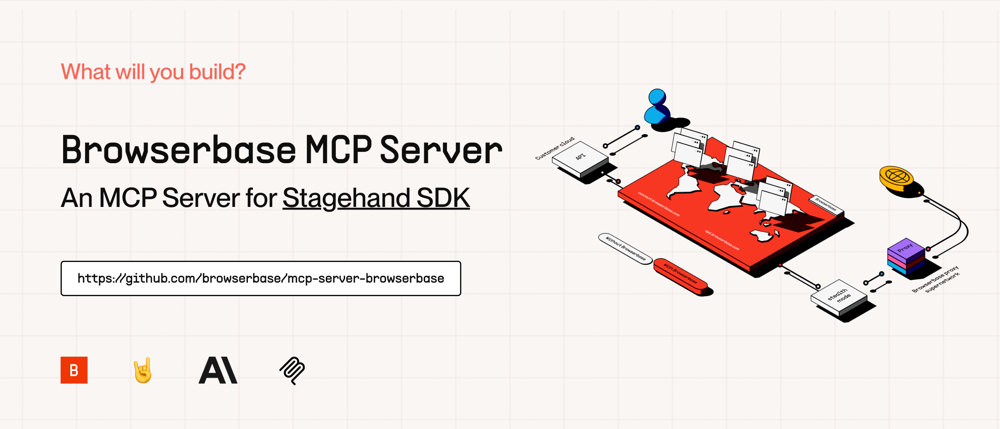

# Stagehand MCP Server



A Model Context Protocol (MCP) server that provides AI-powered web automation capabilities using [Stagehand](https://github.com/browserbase/stagehand). This server enables LLMs to interact with web pages, perform actions, extract data, and observe possible actions in a real browser environment.

## Get Started

1. Run `npm install` to install the necessary dependencies, then run `npm run build` to get `dist/index.js`.

2. Set up your Claude Desktop configuration to use the server.  

```json
{
  "mcpServers": {
    "stagehand": {
      "command": "node",
      "args": ["path/to/mcp-server-browserbase/stagehand/dist/index.js"],
      "env": {
        "BROWSERBASE_API_KEY": "<YOUR_BROWSERBASE_API_KEY>",
        "BROWSERBASE_PROJECT_ID": "<YOUR_BROWSERBASE_PROJECT_ID>",
        "OPENAI_API_KEY": "<YOUR_OPENAI_API_KEY>",
      }
    }
  }
}
```

3. Restart your Claude Desktop app and you should see the tools available clicking the 🔨 icon.

4. Start using the tools! Below is a demo video of Claude doing a Google search for OpenAI using stagehand MCP server and Browserbase for a remote headless browser.

<div>
    <a href="https://www.loom.com/share/9fe52fd9ab24421191223645366ec1c5">
      <p>Stagehand MCP Server demo - Watch Video</p>
    </a>
    <a href="https://www.loom.com/share/9fe52fd9ab24421191223645366ec1c5">
      
    </a>
  </div>

## Tools

### Stagehand commands

- **stagehand_navigate**
  - Navigate to any URL in the browser
  - Input:
    - `url` (string): The URL to navigate to

- **stagehand_act**
  - Perform an action on the web page
  - Inputs:
    - `action` (string): The action to perform (e.g., "click the login button")
    - `variables` (object, optional): Variables used in the action template

- **stagehand_extract**
  - Extract data from the web page 

- **stagehand_observe**
  - Observe actions that can be performed on the web page
  - Input:
    - `instruction` (string, optional): Instruction for observation

### Resources

The server provides access to one resource:

1. **Console Logs** (`console://logs`)

   - Browser console output in text format
   - Includes all console messages from the browser

2. **Screenshots** (`screenshot://<n>`)
   - PNG images of captured screenshots
   - Accessible via the screenshot name specified during capture

## File Structure

The codebase is organized into the following modules:

- **index.ts**: Entry point that initializes and runs the server.
- **server.ts**: Core server logic, including server creation, configuration, and request handling.
- **tools.ts**: Definitions and implementations of tools that can be called by MCP clients.
- **prompts.ts**: Prompt templates that can be used by MCP clients.
- **resources.ts**: Resource definitions and handlers for resource-related requests.
- **logging.ts**: Comprehensive logging system with rotation and formatting capabilities.
- **utils.ts**: Utility functions including JSON Schema to Zod schema conversion and message sanitization.

## Module Descriptions

### index.ts

The main entry point for the application. It:
- Initializes the logging system
- Creates the server instance
- Connects to the stdio transport to receive and respond to requests

### server.ts

Contains core server functionality:
- Creates and configures the MCP server
- Defines Stagehand configuration
- Sets up request handlers for all MCP operations
- Manages the Stagehand browser instance

### tools.ts

Implements the tools that can be called by MCP clients:
- `stagehand_navigate`: Navigate to URLs
- `stagehand_act`: Perform actions on web elements
- `stagehand_extract`: Extract structured data from web pages
- `stagehand_observe`: Observe elements on the page
- `screenshot`: Take screenshots of the current page

### prompts.ts

Defines prompt templates for MCP clients:
- `click_search_button`: Template for clicking search buttons

### resources.ts

Manages resources in the MCP protocol:
- Currently provides empty resource and resource template lists

### logging.ts

Implements a comprehensive logging system:
- File-based logging with rotation
- In-memory operation logs
- Log formatting and sanitization
- Console logging for debugging

### utils.ts

Provides utility functions:
- `jsonSchemaToZod`: Converts JSON Schema to Zod schema for validation
- `sanitizeMessage`: Ensures messages are properly formatted JSON

## Key Features

- AI-powered web automation
- Perform actions on web pages
- Extract structured data from web pages
- Observe possible actions on web pages
- Simple and extensible API
- Model-agnostic support for various LLM providers

## Environment Variables

- `BROWSERBASE_API_KEY`: API key for BrowserBase authentication
- `BROWSERBASE_PROJECT_ID`: Project ID for BrowserBase
- `OPENAI_API_KEY`: API key for OpenAI (used by Stagehand)
- `DEBUG`: Enable debug logging

## MCP Capabilities

This server implements the following MCP capabilities:

- **Tools**: Allows clients to call tools that control a browser instance
- **Prompts**: Provides prompt templates for common operations
- **Resources**: (Currently empty but structured for future expansion)
- **Logging**: Provides detailed logging capabilities

For more information about the Model Context Protocol, visit:
- [MCP Documentation](https://modelcontextprotocol.io/docs)
- [MCP Specification](https://spec.modelcontextprotocol.io/)

## License

Licensed under the MIT License.

Copyright 2024 Browserbase, Inc.
